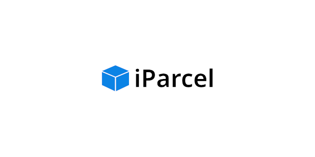

## Introduction

This is an open source CMS for post/parcel services made using the Slim Framework as part of Dr. Uma Ramamurthy's Database Systems class at the University of Houston.

## Requirements

* PHP 8.0
* Composer
* NGINX or Apache or other web server
* MySQL Server 8.0
* MySQL Workbench 8.0
* (Optional, but quicker) Docker

## Installation

### using Docker

### without Docker

As per the requirements, PHP and MySQL will be needed along with its associated software. If you're on Windows it's recommended to use something like [Laragon](https://laragon.org) as it provides almost everything you'll need to get started (including a web server). If you're on macOS or Linux (which are similiar systems) you'll have to install each component by hand.

MySQL Workbench is a completely different application that is not bundled with MySQL itself. It is required to view the database schematics and import it before running the app.

**Action required: If you skip the MySQL Workbench part, the app will error out and nothing will work.**

Instructions are not provided here on how to import the MySQL database schematics.

Once you've completed the above steps, [you can move on to installing Composer](https://getcomposer.org/download/). It's recommended to use the installer so it can set Composer to your PATH without much work.

We can now get started by cloning the code repository (or its stable release branch) using your Terminal app.

```
git clone -b <version> https://github.com/Zentro/<project name>
```

While in the Terminal app, install the app dependencies via Composer.
```
composer install
```

Rename the included `.env.example` file to `.env` and fill out variables according to your device's environment. You can do this through your Terminal app or using a text editor.

**Action required: Not changing the .env file will cause the app to error out because the database configuration will be blank by default.**

Be sure to have MySQL running before running the web server. Done!

You can also optionally use Composer to run a local PHP dev server (with MySQL still needing to be started manually).
```
composer dev-run
```